# Architecture

This document describes how the projection engine is put together, how data flows through it, and
how the design keeps the backtest honest. The authoritative definition of every table and interface
is [ADR 0001: shared data contract](adr/0001-data-contract.md) and the code it points to
(`src/contracts.py`); this page explains the shape around it.

Status as of 2026-09-28: the whole pipeline below is built — contract, parquet store, synthetic league,
fantasy points engine, ingest, models, value board, backtest, live app and the in-season/ops tooling.
Sections below and the "Where things live" table say what exists and point at the ADR for each piece;
`PLANNING.md` section 1a and `README.md`'s Status table have the fuller done/open breakdown.

## Pipeline

```mermaid
flowchart LR
    subgraph Sources["External sources (unofficial, not committed)"]
        NBA["stats.nba.com via nba_api"]
        ESPN["ESPN league (espn-api, Phase 5)"]
    end

    RAW[("raw/SOURCE/<br/>cached pulls")]
    subgraph Contract["Contract tables (parquet, src/contracts.py)"]
        direction TB
        GL[game_logs]
        TG[team_games]
        PL[players]
        BIO[player_season_bio]
        MAP[player_id_map]
    end
    HIST["History.until(tables, S)<br/>leakage guard"]
    PROJ["Projectors<br/>naive baseline, regularized models,<br/>gradient boosting"]
    PT[(projections)]
    FP["Fantasy points engine<br/>src/value/points.py, frame.py"]
    VAL["Value engine and board<br/>VORP, tiers, floor/ceiling"]
    BT["Walk-forward backtest<br/>metrics, benchmarks, ablations"]
    APP["Live app<br/>draft board, trades, waivers"]

    NBA --> RAW
    ESPN -.-> RAW
    RAW -->|"src/ingest"| Contract
    Contract --> HIST
    HIST -->|"only seasons before S"| PROJ
    PROJ --> PT
    PT --> FP
    Contract -->|"actual season S"| FP
    FP --> VAL
    VAL --> APP
    VAL --> BT
    FP -->|"projected vs actual FP"| BT
```

Reading the diagram: a model never sees the raw tables. It receives a `History` for the season it is
projecting and returns a `projections` table. The same fantasy points engine turns both projected and
actual stat lines into points, so a model is scored in exactly the units the league uses.

## Data flow and tables

Tables are Parquet files under `data_dir()/processed/<table>.parquet` (default
`~/dev-data/nba-fantasy-2026`, override with `NBA_DATA_DIR`). They are written atomically by
`src/store.py` and validated against their `TableSpec` on the way in and out. Raw pulls live under
`data_dir()/raw/<source>/` so everything can be rebuilt offline.

| Table | Key | Producer | Consumers | Purpose |
|---|---|---|---|---|
| `game_logs` | `game_id`, `player_id` | ingest | features, models, backtest | One row per player per game played (regular season). No row for a game not played |
| `team_games` | `game_id`, `team_id` | ingest | features, models | Every team game; used to derive games missed |
| `players` | `player_id` | ingest | models | Static attributes (birthdate, position, draft), nullable where the source lacks them |
| `player_season_bio` | `season`, `player_id` | ingest | models | Age at season start (as of Oct 1) and per-season bio |
| `player_id_map` | `source`, `source_id` | ingest | ingest, ESPN sync | Canonical map onto NBA `PERSON_ID`, with confidence and match method |
| `projections` | `season`, `player_id`, `model` | models | value, backtest, app | Per-game stat projections, `proj_fppg`, `proj_gp`, floor/median/ceiling (debutant models add `projection_class`, `p_play`) |
| `player_profiles` | `player_id` | `nba_profiles` | models (debutants, origin), backtest | Country, previous organisation, origin class, size, draft slot, birthdate (ADR 0016) |
| `draft_combine` | `draft_year`, `player_id` | `nba_profiles` | backtest (rookie origin) | Measured height, wingspan, reach, jumps, agility |
| `espn_status_snapshots` | `snapshot_date`, `espn_id` | `espn_status` | value (risk overlay) | Dated ESPN injury status; append-only |

Conventions worth knowing: seasons are strings such as `"2023-24"`; canonical identity is the NBA
`PERSON_ID`; league config keys (`3PM`, `TO`) are translated to columns (`fg3m`, `tov`) by the single
`STAT_COLUMN_MAP`; availability is `team_games` minus the player's `game_logs`.

## Leakage-guard design

A walk-forward backtest is only meaningful if projecting season S cannot use anything from season S or
later. The design makes that a structural property, not a convention:

1. **Projectors never receive raw tables.** The `Projector` protocol is
   `project(history: History) -> projections`. The only way to build a `History` is
   `History.until(tables, target_season)`, which drops every season-indexed row with
   `season >= target_season`.
2. **`History.assert_no_future()`** re-checks the sliced frames and raises if a leak slipped in. The
   leakage tests (`tests/test_contracts.py`: `test_history_until_excludes_target_and_future`,
   `test_assert_no_future_detects_leak`, `test_history_slices_extras`) call it, and CI runs them on every
   push, on Linux and Windows.
3. **Extra feature tables are sliced too.** Any table passed to `History.until` that is not one of the
   four core history tables is treated as an extra and sliced by its `season` column. This is what makes
   the extension points below safe.
4. **The backtest harness owns the loop.** It builds one `History` per season, calls the projector, and
   only then joins the result to actuals. Models cannot reach the actuals because they are never passed
   them.
5. **No reported result may use synthetic data.** The synthetic league exists to unit-test code against
   a known generating process, not to produce numbers.

Known limit: `History.until` can only slice a table that has a `season` column. A future feature table
without one would pass through unsliced, so every extension table must carry a `season` column
(see "as-of" rules below), and its producer's tests must include a leakage test.

## Where things live

| Path | Contents | Status |
|---|---|---|
| `src/contracts.py` | Table specs, season helpers, `History`, `Projector`, validation | done |
| `src/store.py` | Atomic parquet read/write with validation | done |
| `src/synthetic.py` | Contract-valid synthetic league with a known generating process | done |
| `src/value/points.py`, `league.py`, `frame.py` | Fantasy points engine, league config loader, vectorized points frame | done |
| `config/league.yaml` | League settings and scoring weights (single source of truth) | done |
| `src/ingest/` | `nba_api` ingestion into the contract tables (`python -m src.ingest.nba_stats`) | done |
| `src/features/` | Feature builders that turn a `History` into model inputs | done (`injury.py`, ADR 0006; `offseason.py`, ADR 0012; and the later layers below) |
| `src/models/` | Projectors (naive baseline first, then regularized and boosted models) | done |
| `src/value/board.py` | Value over replacement, tiers, draft board (`python -m src.value.board`) | done |
| `src/backtest/` | Walk-forward harness, benchmarks, ablation runner (`python -m src.backtest`) | done |
| `src/ingest/nba_offseason.py`, `nba_incoming.py`, `preseason_refresh.py` | Summer League + preseason box scores; incoming draft class and dated roster snapshots; one command that runs them and the ADP refresh in order (ADR 0012) | done |
| `src/models/offseason_baseline.py` | `baseline_offseason` family: stacked, CV-gated Summer League / preseason adjustment | done |
| `src/backtest/breakouts.py`, `src/value/breakouts.py` | Walk-forward breakout evaluation; the breakout watchlist and its calibration | done |
| `src/inseason/` | In-season tools: matchup weeks, `schedule_games` (standalone table), rest-of-season projection, slot-aware lineup value, trade analyzer, waiver finder, minutes signals; CLIs `python -m src.inseason.<name>` (ADR 0015) | done, untested on a live season |
| `src/ops/` | Daily pre-draft refresh (`python -m src.ops.daily_refresh`): steps in subprocesses, dated ESPN snapshot archive, diffed report, lock, status, alerts; `src.ops.schedule` registers it with Windows Task Scheduler, window and final pre-draft runs derived from `draft.date`/`draft.start_utc` in `config/league.yaml` (ADR 0014); `src.ops.txn_watch`, the transaction tracker over the ESPN-feed ledger (`src/ingest/espn_transactions.py`, `src/features/txn_impact.py`; ADR 0017). In-season nightly job (`python -m src.ops.nightly`, `live_ingest`, `nightly_analysis`, `nightly_report`; ADR 0018): incremental game ingest, ESPN league sync, ROS, waiver/streaming/alert/lineup artifacts, season-window gate, second scheduled task; the daily refresh also refreshes head coaches (`src/ingest/wiki_coaches.py`, ADR 0020) | done; the nightly job has run live only before the season (ADR 0018) |
| `src/app/` | Streamlit live draft board (`streamlit run src/app/draft_board.py`); `src/app/live_sync.py` auto-detects opponents' picks from the ESPN league sync during a live draft, with the manual "Mark drafted" form always kept as the fallback (ADR 0025); the in-season page (`src/app/pages/inseason.py`: trades, waivers, schedule; ADR 0015) is built on `src/inseason/`. The trade analyzer tab shows a magnitude-bucketed confidence read on `TradeResult`'s tolerance band and per-player advisory caveats (ESPN status, return/load-management flags), plus an optional partner-side score (ADR 0027); the external rankings page (`src/app/pages/external_rankings.py`: our board rank vs. manually-exported
Yahoo/FantasyPros snapshots, matched via `src/ingest/id_map.py`; ADR 0028) is built on `src/ingest/external_rankings.py` and `src/value/rankings_compare.py` | draft board done, see `docs/app.md` |
| `tests/` | Unit and integration tests; `test_repo_*.py` cover the repo tooling and docs | ongoing |
| `docs/adr/` | Architecture decision records | see [ADR index](adr/README.md) |

## Extension points: injury, roster and contract layers

Status: all three are built and ablated (ADR 0006, 0010, 0013; the contract layer's veteran half, ADR 0019, reads dated Wikipedia contract events from an ad-hoc `player_contracts` table that reaches models as `History.extras`, tagged with the season each event follows). The contract layer could only be built for the draft-derived
rookie-scale clock (no point-in-time salary source), as a stacked projector over `History.players`, and it showed no lift; the steps
below describe the general route for a future dated source.

[PLANNING.md](../PLANNING.md) stages the model as baseline, then injury, roster context, contract. Each
layer is designed to plug in without touching the harness or other layers:

1. **Produce a new contract table** (register a `TableSpec` in `src/contracts.py`, which needs an ADR
   update as ADR 0001 requires). Examples: `injury_events`, `roster_context`, `contracts`.
2. **Give it a `season` column** and make every value "as of" before that season starts (for example a
   contract snapshot taken at the start of the season, not the season's final state). This is what lets
   `History.until` slice it and puts it in `History.extras`.
3. **Write a feature builder** in `src/features/` that reads `history.extras[...]` and returns model
   inputs. It must not read anything else from disk.
4. **Add it to a projector** behind a flag, so the ablation runner can produce the table
   baseline, +injury, +roster, +contract, and keep a layer only if the backtest shows lift.
5. **Add a leakage test** that builds a `History` for season S and asserts that the new table's rows all
   pre-date S.

Rookies and returners follow the same route with a separate projector path keyed on draft position and
prior-league stats.

## Repository tooling

Development is parallel by design: each track works in its own git worktree, and `./dev integrate`
serializes the short rebase, verify and fast-forward step behind a lock. The rules are in
[CLAUDE.md](../CLAUDE.md) and the workflow is summarized in [CONTRIBUTING.md](../CONTRIBUTING.md).
